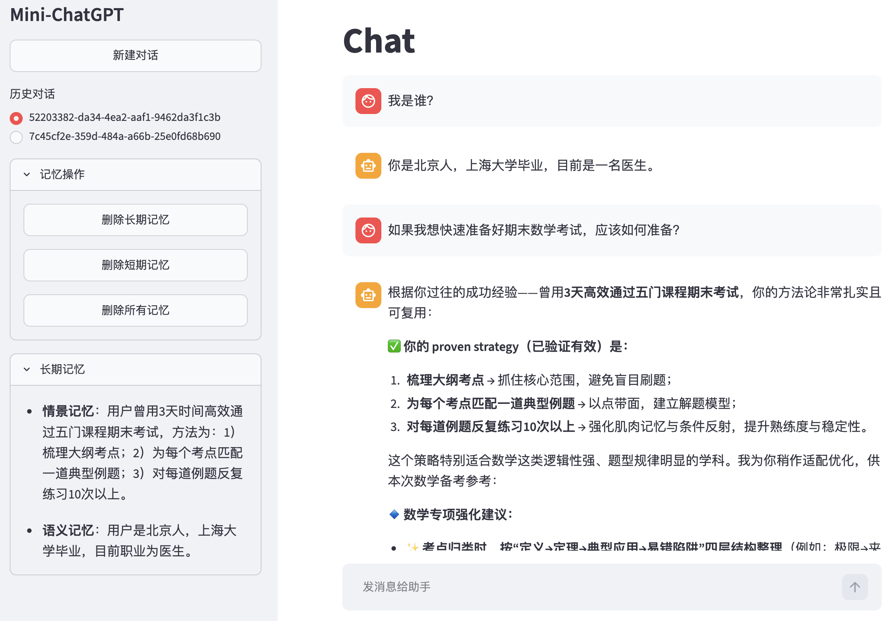
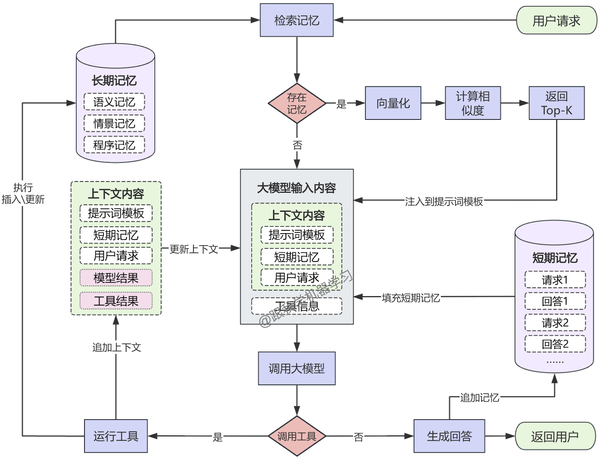

# Mini-ChatGPT 教学版说明（由Codex生成）

简易版的ChatGPT核心逻辑实现，包括长期记忆及短期记忆的管理复用，提供了本地Json文件存储及Postgres存储两种示例，仅供学习。

<div align=center> </div>

这个仓库包含两个“带记忆的 ChatGPT”最小示例，各自独立，可分开运行：

1. `mini-chatgpt`
通过本地 JSON 文件保存长期记忆，短期记忆保存在 Python 进程里的 `history` 列表中。

2. `mini-chatgpt-langgraph`
通过 LangGraph 管理对话流程，短期记忆交给 `checkpointer`，长期记忆交给 `PostgresStore`。

这两个示例非常适合教学，因为它们展示了同一个核心问题的两种实现路径：

- 不依赖框架时，我们如何自己拼出一个“像 ChatGPT 一样”的记忆型助手
- 依赖 LangGraph 时，我们如何把记忆、线程、状态管理交给框架

## 1. 你能从这个仓库学到什么

读完并跑通这两个示例后，建议至少要搞懂下面三件事：

1. 什么是短期记忆，什么是长期记忆
2. ChatGPT 一轮对话的核心逻辑到底是什么
3. 为什么“记忆”本质上不是模型参数，而是运行时上下文的一部分

可以把这两个项目理解为：

- `mini-chatgpt`：手写版原理教学
- `mini-chatgpt-langgraph`：工程化版原理教学

## 2. 先建立一个总模型

很多同学第一次接触大模型应用时，会误以为“模型像人脑一样一直记得之前的内容”。  
实际上，在应用层里，一个聊天助手更接近下面这个过程：

```text
用户输入
  -> 检索相关长期记忆
  -> 拼接系统提示词 + 短期对话历史 + 当前问题
  -> 调用大模型
  -> 如果模型要用工具，就先执行工具
  -> 再把工具结果喂回模型
  -> 得到最终回答
```

也就是说，一个极简版 ChatGPT 往往由下面几层构成：

- 大模型：负责生成语言、理解上下文、决定是否调用工具
- 系统提示词：规定助手的角色、边界和行为规则
- 短期记忆：保存当前会话里最近几轮消息
- 长期记忆：保存跨会话仍然有价值的信息
- 工具系统：让模型可以“做事”，比如写入记忆
- 对话循环：模型回答一次，如果调用了工具，就继续循环直到产出最终文本

## 3. 什么是短期记忆

短期记忆可以理解为“当前会话上下文”。

它的特点是：

- 生命周期短，通常只在一个会话线程里有效
- 直接参与当前轮次的提示词拼接
- 更像“聊天记录”而不是“用户档案”

例如下面这些通常属于短期记忆：

- 用户刚刚问了什么
- 助手上一轮怎么回答的
- 当前这个任务的上下文
- 本轮工具执行完返回了什么

在本仓库里：

- `mini-chatgpt` 中，短期记忆就是 [`mini-chatgpt/src/cli.py`](Mini-ChatGPT/mini-chatgpt/src/cli.py) 里的 `history`
- `mini-chatgpt-langgraph` 中，短期记忆由 LangGraph 的 `checkpointer` 按 `thread_id` 自动管理

## 4. 什么是长期记忆

长期记忆可以理解为“跨会话仍有价值的信息”。

它的特点是：

- 不只服务当前一轮对话
- 下一次打开新会话时仍然可能被检索出来
- 通常是用户画像、偏好、长期目标、持续项目、稳定事实

例如下面这些通常适合长期保存：

- 用户正在学习 Python
- 用户偏好中文回答
- 用户长期在做 LangGraph 相关项目
- 用户希望回答时先给结论再展开

而下面这些一般不适合写入长期记忆：

- “帮我把这一行代码改一下”
- “今天下午 3 点提醒我”
- “刚刚那条报错先忽略”
- 当前会话里的临时上下文

在这个仓库中，长期记忆被分成三类：

- `episodic`：情景记忆，记录发生过的事件或经历
- `semantic`：语义记忆，记录稳定事实、偏好、身份、目标
- `procedural`：程序性记忆，记录用户希望助手长期遵循的协作方式

这部分规则主要写在两个项目的 [`prompts.py`](Mini-ChatGPT/mini-chatgpt/src/prompts.py) 和 [`mini-chatgpt-langgraph/src/prompts.py`](Mini-ChatGPT/mini-chatgpt-langgraph/src/prompts.py) 中。

## 5. ChatGPT 的核心逻辑

如果只保留最关键的主干逻辑，可以把这个仓库理解成下面这套流程：

<div align=center> </div>

这其实就是一个很典型的 Agent 最小闭环：

1. 输入用户问题
2. 找出和当前问题相关的长期记忆
3. 把长期记忆和短期记忆一起塞进上下文
4. 让模型决定是直接回答，还是先调用工具
5. 如果模型调用 `upsert_memory`，就把新记忆保存下来
6. 再让模型基于“工具执行后的结果”继续回答

这也是为什么很多人会说：

> 一个能工作的 ChatGPT 应用，不只是“调用一次模型 API”，而是“模型 + 上下文 + 工具 + 状态管理”。

## 6. 两个版本的区别

| 维度 | `mini-chatgpt` | `mini-chatgpt-langgraph` |
| --- | --- | --- |
| 短期记忆 | 手动维护 `history` 列表 | LangGraph `checkpointer` 按 `thread_id` 管理 |
| 长期记忆 | 本地 JSON 文件 | `PostgresStore` |
| 检索方式 | 本地 embedding + 相似度排序 | `PostgresStore` + 可选 pgvector |
| 对话流程 | 自己写循环 | 用 LangGraph Graph 承载 |
| 工程复杂度 | 更低，适合入门 | 更高，适合理解工程化 Agent |
| 教学重点 | 原理拆解最直观 | 状态管理和多会话更清晰 |

如果你是第一次学，建议阅读顺序是：

1. 先看 `mini-chatgpt`
2. 再看 `mini-chatgpt-langgraph`
3. 最后对比两者“哪些代码是业务逻辑，哪些代码是框架接管的”

## 7. 示例1：本地 JSON 版

目录：

- [`mini-chatgpt/main.py`](Mini-ChatGPT/mini-chatgpt/main.py)
- [`mini-chatgpt/src/cli.py`](Mini-ChatGPT/mini-chatgpt/src/cli.py)
- [`mini-chatgpt/src/agent.py`](Mini-ChatGPT/mini-chatgpt/src/agent.py)
- [`mini-chatgpt/src/store.py`](Mini-ChatGPT/mini-chatgpt/src/store.py)
- [`mini-chatgpt/src/tools.py`](Mini-ChatGPT/mini-chatgpt/src/tools.py)

### 7.1 它是怎么工作的

这个版本最适合拿来解释“记忆型 ChatGPT 的最小实现”。

核心思路是：

- 短期记忆：CLI 中维护 `history`
- 长期记忆：每个用户对应一个本地 JSON 文件
- 每轮问答前：先用当前问题搜索相关长期记忆
- 每轮问答中：模型可以调用 `upsert_memory` 写入新记忆
- 每轮结束后：把本轮用户消息和模型回复追加回 `history`

### 7.2 关键代码阅读顺序

1. 看入口 [`mini-chatgpt/main.py`](Mini-ChatGPT/mini-chatgpt/main.py)
2. 看交互循环 [`mini-chatgpt/src/cli.py`](Mini-ChatGPT/mini-chatgpt/src/cli.py)
3. 看主逻辑 [`mini-chatgpt/src/agent.py`](Mini-ChatGPT/mini-chatgpt/src/agent.py)
4. 看长期记忆存储 [`mini-chatgpt/src/store.py`](Mini-ChatGPT/mini-chatgpt/src/store.py)
5. 看模型如何调用记忆工具 [`mini-chatgpt/src/tools.py`](Mini-ChatGPT/mini-chatgpt/src/tools.py)

### 7.3 建议重点观察

- `MemoryAgent.respond()`：整轮对话的核心闭环
- `JsonMemoryStore.search()`：如何把“记忆检索”接到回答前
- `JsonMemoryStore.upsert()`：如何新增或更新长期记忆
- `_format_memories()`：为什么要把检索结果格式化后注入系统提示词

### 7.4 这个版本的教学价值

- 好处：代码直白，最容易看懂原理
- 局限：短期记忆在进程内，程序退出后就没了；多会话管理也要自己做

## 8. 示例2：LangGraph 版

目录：

- [`mini-chatgpt-langgraph/main.py`](Mini-ChatGPT/mini-chatgpt-langgraph/main.py)
- [`mini-chatgpt-langgraph/src/agent.py`](Mini-ChatGPT/mini-chatgpt-langgraph/src/agent.py)
- [`mini-chatgpt-langgraph/src/store.py`](Mini-ChatGPT/mini-chatgpt-langgraph/src/store.py)
- [`mini-chatgpt-langgraph/src/cli.py`](Mini-ChatGPT/mini-chatgpt-langgraph/src/cli.py)
- [`mini-chatgpt-langgraph/src/tools.py`](Mini-ChatGPT/mini-chatgpt-langgraph/src/tools.py)

### 8.1 它是怎么工作的

这个版本把“状态管理”进一步工程化了。

核心思路是：

- 短期记忆不再由我们手写 `history`
- LangGraph 用 `thread_id` 把每个会话线程隔离开
- `PostgresSaver` 保存短期对话快照
- `PostgresStore` 保存长期记忆
- Agent 逻辑仍然是“检索长期记忆 -> 调模型 -> 工具调用 -> 继续调模型”

### 8.2 关键代码阅读顺序

1. 看入口 [`mini-chatgpt-langgraph/main.py`](Mini-ChatGPT/mini-chatgpt-langgraph/main.py)
2. 看 Graph 定义和 `chat()` 节点 [`mini-chatgpt-langgraph/src/agent.py`](Mini-ChatGPT/mini-chatgpt-langgraph/src/agent.py)
3. 看长期记忆存储 [`mini-chatgpt-langgraph/src/store.py`](Mini-ChatGPT/mini-chatgpt-langgraph/src/store.py)
4. 看命令行如何切换会话 [`mini-chatgpt-langgraph/src/cli.py`](Mini-ChatGPT/mini-chatgpt-langgraph/src/cli.py)
5. 看记忆工具 [`mini-chatgpt-langgraph/src/tools.py`](Mini-ChatGPT/mini-chatgpt-langgraph/src/tools.py)

### 8.4 建议重点观察

- `get_agent()`：LangGraph 图是怎么组装出来的
- `invoke_agent()`：为什么同时需要 `thread_id` 和业务 `Context`
- `chat()`：和 JSON 版相比，哪些逻辑没变，哪些被框架接管了
- `clear_short()` / `clear_long()`：短期记忆和长期记忆为什么要分开清理

### 8.4 这个版本的教学价值

- 好处：更贴近真实项目，天然支持多线程、多会话、持久化短期状态
- 局限：抽象更多，初学者一开始可能不如 JSON 版直观

## 9. 为什么要区分 `user_id` 和 `thread_id`

这是记忆系统里非常重要的一点。

- `user_id`：表示“这个人是谁”
- `thread_id`：表示“当前这次会话是哪一条线程”

一个用户可以有很多会话线程，所以通常是：

- 长期记忆挂在 `user_id` 上
- 短期记忆挂在 `thread_id` 上

这也是 LangGraph 版更适合教学的一点，因为它把这两个概念分得很清楚。

## 10. 为什么系统提示词里要写“保存什么，不保存什么”

因为模型不会天然知道什么值得长期保存。

如果你不给规则，它可能会：

- 把临时问题也存起来
- 把噪声信息当作长期偏好
- 重复保存相似记忆
- 把当前会话里的瞬时上下文错误地当成用户画像

所以在这类应用里，`prompt` 其实是在做一件很重要的事情：

它不是单纯让模型“说话更像助手”，而是在教模型如何做记忆决策。

## 11. 为什么长期记忆要先检索，再注入提示词

因为模型的上下文窗口有限，不可能每次都把所有记忆全部塞进去。

一个常见模式就是：

1. 用户发来新问题
2. 用这个问题去搜最相关的几条长期记忆
3. 只把最相关的记忆放进本轮系统提示词
4. 模型基于“当前问题 + 相关记忆”回答

这就是检索增强的一种非常轻量的形式。  
所以长期记忆系统并不是“模型永远记住了什么”，而是“应用在每一轮把有用信息重新拿给模型看”。

## 12. 两个项目里最值得学生亲手改的点

如果你是拿这个仓库做教学或自学练习，建议按下面顺序动手：

1. 修改系统提示词，观察模型保存记忆的积极程度会怎么变化
2. 故意输入一些“短期信息”，看模型是否会错误保存
3. 为 JSON 版增加“只保留最近 N 轮短期消息”的逻辑
4. 为 LangGraph 版增加“按 memory_type 分类查看记忆”的命令
5. 尝试给长期记忆增加“重要度”字段
6. 观察“有记忆”和“无记忆”时回答风格的差异

这些练习会帮助你真正理解：

- Prompt 会改变工具决策
- 记忆是应用层状态，而不是模型参数
- 框架并不会改变原理，只是帮你管理复杂度

## 13. 推荐阅读顺序

如果是教学场景，我推荐按下面顺序讲：

1. 先讲“普通聊天机器人为什么不是真正有记忆”
2. 再讲短期记忆和长期记忆的区别
3. 先带学生读 JSON 版
4. 让学生自己画出 `respond()` 的调用流程
5. 再切到 LangGraph 版，看哪些代码被框架替代了
6. 最后讨论工程化问题：多用户、多线程、数据库、检索、清理策略

## 14. 如何运行

这两个示例都依赖 DashScope 的兼容接口调用 Qwen，因此运行前至少需要准备：

- `DASHSCOPE_API_KEY`

可以放到环境变量里，也可以写入 `.env`。

### 14.1 运行本地 JSON 版

进入目录后执行：

```bash
cd mini-chatgpt
python main.py
```

常用命令：

- `/help`
- `/memories`
- `/clear`
- `/exit`

### 14.2 运行 LangGraph 版

这个版本除了模型 API Key，还需要 PostgreSQL。

环境变量：

- `DASHSCOPE_API_KEY`
- `POSTGRES_URI`

命令行模式：

```bash
cd mini-chatgpt-langgraph
python main.py --cli
```

如果环境里装了 Streamlit，也可以直接运行页面版：

```bash
cd mini-chatgpt-langgraph
streamlit run main.py
```

常用命令：

- `/new`
- `/thread <id>`
- `/memories`
- `/clear`
- `/clearall`
- `/id`
- `/exit`

## 15. 一句话总结这两个项目

如果只用一句话概括：

- `mini-chatgpt` 教你看懂“ChatGPT + 记忆”的原理骨架
- `mini-chatgpt-langgraph` 教你理解“同样的原理如何走向工程化”

而这两个项目共同想说明的核心是：

> 大模型应用中的“记忆”，本质上是应用层对上下文和状态的组织，而不是模型自己永久记住了一切。

## 附：建议重点读的文件

- [`mini-chatgpt/src/agent.py`](Mini-ChatGPT/mini-chatgpt/src/agent.py)
- [`mini-chatgpt/src/store.py`](Mini-ChatGPT/mini-chatgpt/src/store.py)
- [`mini-chatgpt-langgraph/src/agent.py`](Mini-ChatGPT/mini-chatgpt-langgraph/src/agent.py)
- [`mini-chatgpt-langgraph/src/store.py`](Mini-ChatGPT/mini-chatgpt-langgraph/src/store.py)

如果你要做一次分享或授课，这四个文件基本就是整场内容的主线。
